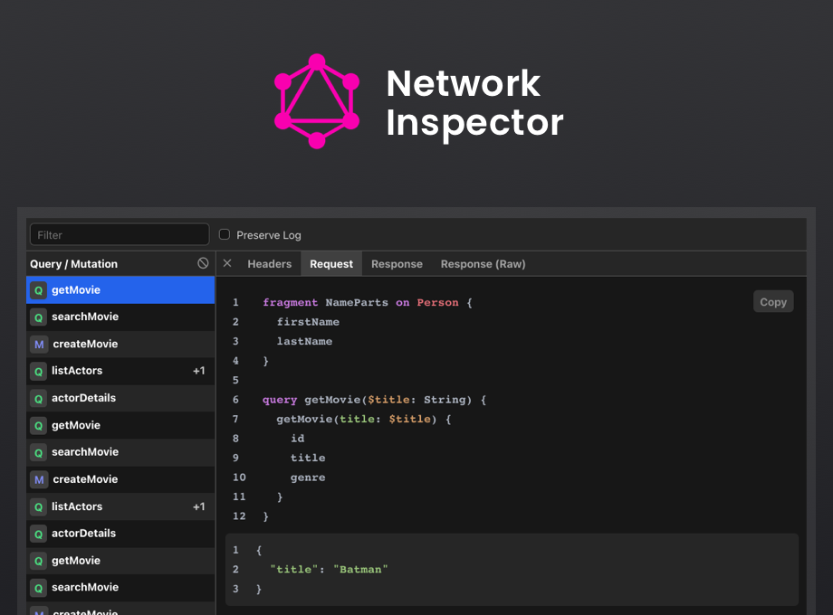

# GraphQL Network Inspector

A platform agnostic network inspector specifically built for GraphQL. Clearly see individual GraphQL requests including support for query batching.

The browser plugin can be found on the [Chrome Webstore](https://chrome.google.com/webstore/detail/graphql-network-inspector/ndlbedplllcgconngcnfmkadhokfaaln)

For product updates follow me on Twitter [@warrenjday](https://twitter.com/warrenjday)

## Desktop App

To inspect traffic from other browsers such as Firefox and Safari try the desktop app at https://graphproxy.com

With desktop you can inspect traffic from any app or browser plus intercept inflight requests to see how your app can handle different responses.

## Contribute

PRs are welcome! The best way to do this is to first fork the repository, create a branch and open a pull request back to this repository.

If you want to add a large feature please first raise an issue to discuss. This avoids waisted effort.

## License

The MIT License (MIT)

Copyright (c) 2020 GraphQL Network Inspector authors

Permission is hereby granted, free of charge, to any person obtaining a copy
of this software and associated documentation files (the "Software"), to deal
in the Software without restriction, including without limitation the rights
to use, copy, modify, merge, publish, distribute, sublicense, and/or sell
copies of the Software, and to permit persons to whom the Software is
furnished to do so, subject to the following conditions:

The above copyright notice and this permission notice shall be included in all
copies or substantial portions of the Software.

THE SOFTWARE IS PROVIDED "AS IS", WITHOUT WARRANTY OF ANY KIND, EXPRESS OR
IMPLIED, INCLUDING BUT NOT LIMITED TO THE WARRANTIES OF MERCHANTABILITY,
FITNESS FOR A PARTICULAR PURPOSE AND NONINFRINGEMENT. IN NO EVENT SHALL THE
AUTHORS OR COPYRIGHT HOLDERS BE LIABLE FOR ANY CLAIM, DAMAGES OR OTHER
LIABILITY, WHETHER IN AN ACTION OF CONTRACT, TORT OR OTHERWISE, ARISING FROM,
OUT OF OR IN CONNECTION WITH THE SOFTWARE OR THE USE OR OTHER DEALINGS IN THE
SOFTWARE.
